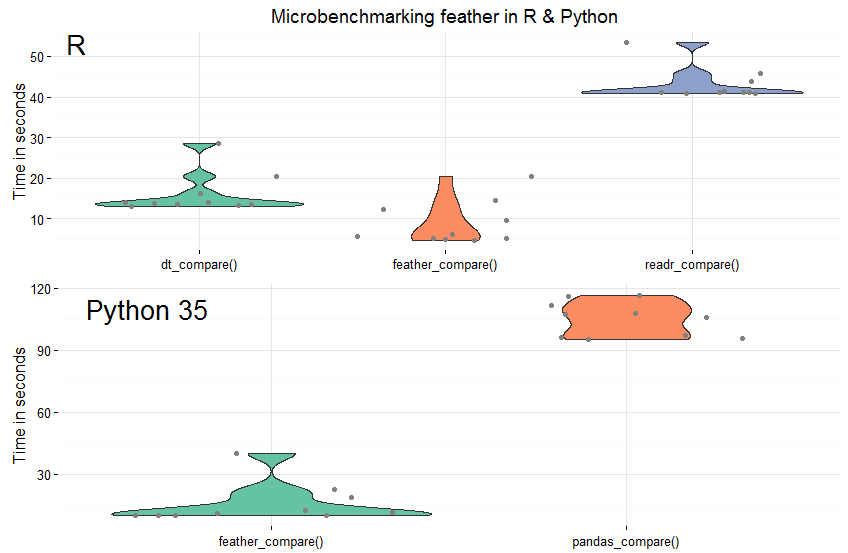

---
title       : Connecting R and Python
subtitle    : Why, when and where
author      : Irina Goloshchapova
job         : Expert CMASF
logo        : logo2.jpg
framework   : io2012      # {io2012, html5slides, shower, dzslides, ...}
highlighter : highlight.js  # {highlight.js, prettify, highlight}
widgets     : [bootstrap]    
mode        : selfcontained # {standalone, draft}
knit        : slidify::knit2slides
--- &vcenter bg:#F0F1EE

<style>
em {
  font-style: italic
}

strong {
  font-weight: bold;
}

sup {
  top: -0.5em;
  vertical-align: baseline;
  font-size: 75%;
  line-height: 0;
  position: relative;
}

bigfont {
  font-size: 70px;
  font-weight: bold;
  color: #535E43;
}

</style>

<bigfont>Почему</bigfont>

--- .class #id 

## Почему

1. **_Синергия преимуществ_**  
     Совмещение мощных и стабильных библиотек R и Python
2. **_Скорость и удобство_**  
    Комбинация имеющихся навыков программирования на R и Python

--- .class #id 

## Почему
### Синергия преимуществ 
*Комбинация мощных и стабильных библиотек R и Python*:
- **_Python_** - язык общего назначения:  
       - Web scraping и crawling (beautifulsoup, Scrapy, и т.д.) 
       - Работа с базами данных и приложениями (sqlachemy, и т.д.) 
       - Реализация классических ML алгоритмов (scikit-learn, pandas, numpy, scipy, и т.д.)  
- **_R_** - обширная коллекция библиотек:  
   - Продвинутый статистический анализ. В особенности, для ряда специфических областей науки и практики (анализ врем. рядов и многое другое) 
   - Интерактивная графика/dashboards/приложения (htmlwidgets, flexdashboard, shiny, slidify, и т.д.)
   - Быстрые и эффективные библиотеки для сложных манипуляций с данными (data.table, big.data.table, dplyr, и т.д.)

--- .class #id 

## Почему
### Скорость и удобство 

*Комбинация имеющихся навыков программирования на R и Python*:

- различный уровень знаний каждого языка у сотрудников в рамках проекта  

- ваш опыт решения конкретных задач на разных языках

- предпочтения по синтаксису

--- &vcenter bg:#F0F1EE

<bigfont>Когда</bigfont>

--- .class #id 

## Когда

1. Исследовательский анализ данных
2. Прототипирование
3. Проект/набор задач с широким охватом по различным научно-практическим областям
4. Очень ~~близкий дедлайн~~ короткие сроки на выполнение задачи

--- &vcenter bg:#F0F1EE

<bigfont>Как</bigfont>

--- .class #id 

## Как

1. **_Command line tools_**. Исполнение скриптов с помощью командной строки + промежуточное хранение файлов на диске (filling air gap)  
      
2. **_Interfacing R and Python_**. Одновременный запуск процессов R и Python и передача данных между ними в оперативной памяти (in-memory) 

3. **_Другие подходы_**

--- {class: class, tpl: tabs}

## Как - Command line tools

*** {class: active, id: cmd}
Исполнение скриптов с помощью командной строки

`<cmd_to_run> <path_to_script> <any_additional_args>`  
  
Command           |Python                                       | R
------------------|---------------------------------------------|--------------------------------------------
*Cmd*   |`python path/to/myscript.py arg1 arg2 arg3`  | `Rscript path/to/myscript.R arg1 arg2 arg3` 
*Fetch arguments* |`#character vector of args`<br>`myArgs <- commandArgs(trailingOnly = TRUE)` | `#list, 1st el. - file executed`<br>`import sys` <br>`my_args = sys.argv`


*** {id: air_gap}

Промежуточное хранение файлов

Medium Storage  | Python     | R
----------------|------------|----------
*Flat files*    | =======    | =======
csv             | csv        | readr, data.table
json            | json       | jsonlite
yaml            | PyYAML     | yaml
*Databases*     | =======    | =======
SQL             | sqlalchemy, pandasql<br>pyodbc | sqlite, RODBS,<br>RMySQL, sqldf, dplyr
NoSQL           | PyMongo    | RMongo
*Feather*       | =======    | =======
for data frames | feather    | feather
*Numpy*         | =======    | =======
for numpy objects | numpy      | [RcppCNPy](http://dirk.eddelbuettel.com/code/rcpp.cnpy.html)

*** {id: benchmark}



--- {class: class, tpl: tabs}

## Как - Command line tools - Примеры

*** {class: active, id: max_R}


```r
# max.R
randomvals <- rnorm(75, 5, 0.5)
par(mfrow = c(1, 2))
hist(randomvals, xlab = 'Some random numbers')
plot(randomvals, xlab = 'Some random numbers', ylab = 'value', pch = 3)
```

*** {id: splitstr_py}


```r
# splitstr.py
import sys

# Get the arguments passed in
string = sys.argv[1]
pattern = sys.argv[2]

# Perform the splitting
ans = string.split(pattern)

# Join the resulting list of elements into a single newline
# delimited string and print
print('\n'.join(ans))
```

*** {id: RfromPy}


```r
# calling R from Python
import subprocess

# Define command and arguments
command = 'Rscript'
path2script = 'path/to your script/max.R'

# Variable number of args in a list
args = ['11', '3', '9', '42']

# Build subprocess command
cmd = [command, path2script] + args

# check_output will run the command and store to result
x = subprocess.check_output(cmd, universal_newlines=True)

print('The maximum of the numbers is:', x)
```

*** {id: PyfromR}


```r
# calling Python from R
command = "python"

# Note the single + double quotes in the string (needed if paths have spaces)
path2script ='"path/to your script/splitstr.py"'

# Build up args in a vector
string = "3523462---12413415---4577678---7967956---5456439"
pattern = "---"
args = c(string, pattern)

# Add path to script as first arg
allArgs = c(path2script, args)

output = system2(command, args=allArgs, stdout=TRUE)

print(paste("The Substrings are:\n", output))
```

--- .class #id 

## Как - Command line tools - Pros&Cons

### Преимущества

- Простой метод и поэтому часто наиболее быстрый
- Просто увидеть промежуточный результат
- Возможность чтения/записи большинства форматов реализована в обоих языках

### Недостатки

- Конструкция быстро становится громоздкой и сложноуправляемой по мере роста числа переходов между языками
- Как правило, существенная потеря в скорости записи/чтения файлов при росте объема данных
- Необходимость заранее согласовывать схему взаимодействия между языками и формат промежуточных файлов

<div class='source'>
  Source: <a href='http://www.mango-solutions.com/wp/2015/12/integrating-python-and-r-part-iii-an-extended-example/'>Блог Mango-solutions</a>
</div>

--- &twocol
  
## Как - Interfacing R and Python
  
<a class="btn btn-medium btn-warning" rel="popover" data-content="Поддержка ОС Windows крайне слабая и неустойчивая :-(" id='example'>Внимание!</a>

*** =left
### R из Python

Packages   | [Comments](http://stackoverflow.com/questions/5630441/how-do-rpy2-pyrserve-and-pyper-compare)
-----------|------------
[*rpy2*](http://rpy2.bitbucket.org/)    | - C-level interface<br>- direct support by pandas<br>- supports graphics (+ggplot2)<br>- [limited windows support](http://eurekastatistics.com/installing-rpy2/)  
[*pyper*](https://pypi.python.org/pypi/PypeR/1.1.0)  | - Python code<br>- use of pipes (on average faster)<br>- undirect support by pandas<br>- limited support for graphics<br>- documentation difficulties
[*pyrserve*](https://pypi.python.org/pypi/pyRserve/) | - Python code<br>- remote computation/through Rserve<br>- no support for data frames

*** =right
### Python из R

Packages   | Comments
-----------|------------
[*rPython*](https://rpython.readthedocs.io/en/latest/)    | - Java code<br>- data transportation through json<br>- no direct data frames transportation<br>- [good documentation](https://cran.r-project.org/web/packages/rPython/rPython.pdf) (simple in use)<br>- [limited windows support](https://github.com/cjgb/rPython-win)<br>- fails with Anaconda Python installation
[*RSPython*](http://www.omegahat.net/RSPython/) | - two-sided interface<br>- no support after 2005<br>- weak windows support
[*Rcpp*](http://gallery.rcpp.org/articles/rcpp-python/) | - through C++ ([Boost.Python](http://www.boost.org/doc/libs/1_55_0/libs/python/doc/) and [Rcpp](http://www.rcpp.org/))<br>- need of specific skills<br>- [good example](http://gallery.rcpp.org/articles/rcpp-python/)

--- {class: class, tpl: tabs}

## Как - Interfacing R and Python - Примеры

*** {class: active, id: rpy2}


```r
from rpy2.robjects import pandas2ri # loading rpy2
from rpy2.robjects import r
pandas2ri.activate() # activating pandas module
df_iris_py = pandas2ri.ri2py(r['iris']) # from r data frame to pandas
df_iris_r = pandas2ri.py2ri(df_iris_py) # from pandas to r data frame 
plotFunc = r("""
   library(ggplot2)
   function(df){
   p <- ggplot(iris, aes(x = Sepal.Length, y = Petal.Length)) 
          + geom_point(aes(color = Species))
   print(p)
   ggsave('iris_plot.pdf', plot = p, width = 6.5, height = 5.5)
 }
""") # ggplot2 example
gr = importr('grDevices') # necessary to shut the graph off
plotFunc(df_iris_r)
gr.dev_off()
```

*** {id: rPython}


```r
library(rPython)

# data frames transportation
python.assign('iris_py_dict', iris) # r data.frame to python dict
python.exec('import pandas as pd')
# convert dict to pd data frame
python.exec('iris_py_df = pd.DataFrame(iris_py_dict)')
# convert pd df back to dict
python.exec('iris_py_dict = iris_py_df.to_dict(outtype = "list")') 
# dict to r list to data frame
iris_df <- data.frame(python.get('py_dict2')) 

# python get/python_load
python.load("hello_world.py") ## hello_world = 'hello' + 'world' +'!'
greeting <- python.get("hello_world")
print(greeting) # class character
```

--- .class #id 

## Как - Interfacing R and Python - Pros&Cons

### Преимущества

- Гибкий и интерактивный способ
- Быстрая взаимная передача объектов в рамках оперативной памяти

### Недостатки

- **Необходимость читать туториалы!**
- Тонкости в сопоставимости объектов и способах их передачи между языками
- Передача больших объемов данных также может быть затруднительной
- Слабая поддержка Windows ОС
- Нестабильность между версиями библиотек

--- .class #id 

## Как - Другие подходы

- Ноутбуки
   - [Jupiter Notebook](http://jupyter.org/)  
         > [IRKernel](http://blog.revolutionanalytics.com/2015/09/using-r-with-jupyter-notebooks.html)  
         > [R magic + rpy2](https://github.com/michhar/rpy2_sample_notebooks/blob/master/TestingRpy2.ipynb)  
   - [Beaker Notebook](http://beakernotebook.com/)  

- Платформы
   - [Sense](https://sense.io/) --> [Cloudera](http://blog.sense.io/sense-joins-cloudera/)
   - [SAS](http://blog.revolutionanalytics.com/2015/05/call-r-and-python-from-base-sas.html)
   - [H2O](http://www.h2o.ai/product/)  
         > [connector for python](https://pypi.python.org/pypi/h2o)  
         > [connector for R](https://cran.r-project.org/web/packages/h2o/h2o.pdf)  
   - ...

--- .class #id 

## Как - Расширенный пример 

<iframe src = "https://pub.beakernotebook.com/publications/bca2b1e2-7202-11e6-899f-7b213714358c?fullscreen=true"> </iframe>

--- .class #id 

## Выводы

- <strong><em>Можнои нужно совмещать R и Python!</em></strong>  
  В особенности в целях исследовательского анализа данных и прототипирования
- Внимательно относитесь к выбору способов совмещения R и Python, основываясь на целях проекта:  
     - <strong>command line tools</strong>: просто, понятно и обязательно будет работать.  
       Отличный способ для начала!  
       Внимание к формату feather!
     - <strong>interfacing R and Python</strong>: быстро, гибко и временами интерактивно.  
       Специфический синтаксис - необходимо читать туториалы, более сложная настройка.  
       Используйте проверенные и стабильные библиотеки: rpy2 и rPython.
     - <strong>другие подходы</strong>. Внимание к проекту Beaker Notebook!

--- {
 tpl: thankyou,
 social: [{title: gmail, href: "igoloshchapova@forecast.ru"},
 {title: github, href: "irinagoloshchapova"},
 {title: repo, href: "Progs/DataFest2016_R_Py"}],
 bg: "#F0F1EE"
}

## Спасибо за внимание

Контакты для связи.
