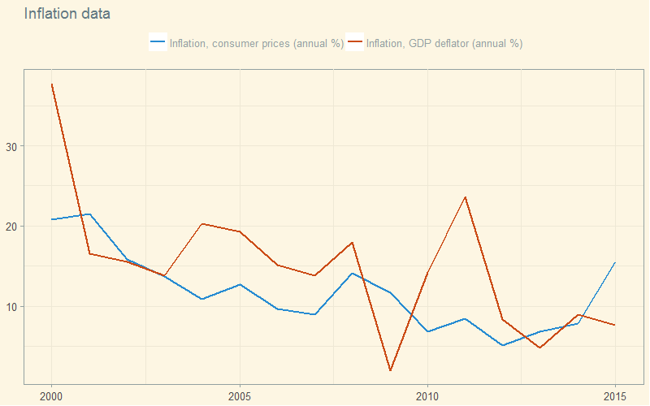
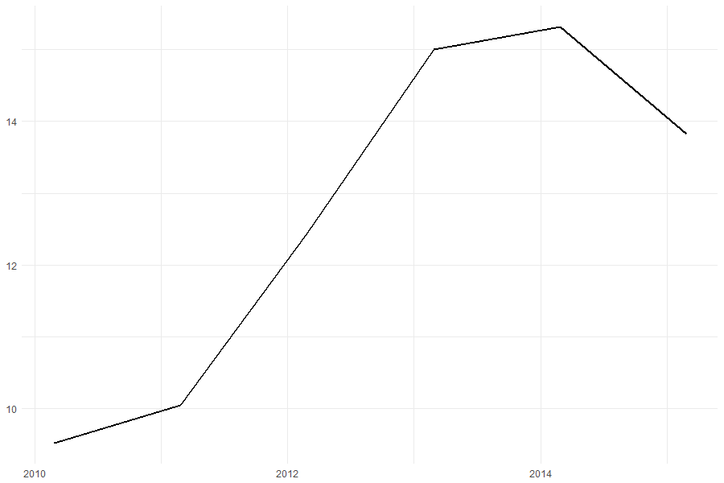

# Intro to download economic data in R


Irina Goloshchapova  
Center for Macroeconomic Analysis and Short-Term Forecasting   
Open Data Science

<script src="http://ajax.googleapis.com/ajax/libs/jquery/1.9.1/jquery.min.js"></script>

--- &vertical
## Plan

- Why we want to automate the download data process  

- What we should use in R if we want download open economic data  

- How we should use it 

***
## Plan  

One thing first!  

Please, open the presentation in local PCs!

Link: http://irinagoloshchapova.github.io/Progs/OpenData_March_2017/  


--- &vertical
## Why automate

***
## Why automate  

- Frequent need to quickly access the data: regular monitoring, dashboard  
- Complex computations with data to obtain final dataset  
- You need big data  
- Database structure in your pocket 

--- &vertical

## What we should use

***
## What we should use   

- R Packages  
- Self connection functions to API  

--- &vertical

## How to use: R packages  

***
## How to use: R Packages  

Firstly: [Google it!](http://bfy.tw/AJQ6)


***
## How to use: R Packages  

- **World Bank**: [WDI](https://github.com/vincentarelbundock/WDI), [wbstats](https://github.com/GIST-ORNL/wbstats)  

- **International Monetary Fund**: [IMFData](https://github.com/mingjerli/IMFData), [imfr](https://github.com/christophergandrud/imfr) 

***
## How to use: R Packages  
### Key principles  

- **Read materials and choose package**: CRAN, *GitHub*  

- **Undestand searching and downloading structure in the chosen package**: Tutorials  

- **Try simple example**: GitHub, R-Bloggers, Google  

- **Download what do you need**: R  

***
## How to use: R Packages  
### Prerequisites 

```{r initialization, echo = TRUE, eval = FALSE}
install.packages(c('devtools', 'tidyverse', 'ggthemes', 'httr', 'jsonlite'))

devtools::install_github("vincentarelbundock/WDI")
devtools::install_github("GIST-ORNL/wbstats")
devtools::install_github('mingjerli/IMFData')
devtools::install_github('christophergandrud/imfr')
```

***
## How to use: R Packages  
### Example: World Bank

**Read materials and choose package**

[WDI](https://github.com/vincentarelbundock/WDI) **_or_** [wbstats](https://github.com/GIST-ORNL/wbstats)

***
## How to use: R Packages  
### Example: World Bank  

<iframe src='https://cran.r-project.org/web/packages/wbstats/vignettes/Using_the_wbstats_package.html' width = '960px' height = '600px'></iframe>

***
## How to use: R Packages  
### Example: World Bank  

**Undestand searching and downloading structure in the chosen package**  

- install package  

- search needed indicators codes  

- define sample of countries  

- define period of time  

- define final data format  

- download

***
## How to use: R Packages  
### Example: World Bank  

**Try simple example**  

```{r simple_download_example, echo = TRUE, eval = FALSE}
library(wbstats)
library(ggplot2)

oil_data <- wb(indicator = c("CRUDE_DUBAI", "CRUDE_BRENT", "CRUDE_WTI", "CRUDE_PETRO"),
               startdate = "2012M01", enddate = "2014M12", freq = "M", POSIXct = TRUE)

ggplot(oil_data, aes(x = date_ct, y = value, colour = indicator)) + geom_line(size = 1) +
  labs(title = "Crude Oil Price Comparisons", x = "Date", y = "US Dollars")
```

***
## How to use: R Packages  
### Example: World Bank  

**Download what do you need**  

```{r our_download_example, echo = TRUE, eval = FALSE}
library(wbstats)
library(ggplot2)

wbsearch(pattern = "inflation", fields = "indicator", extra = TRUE)

#             indicatorID                             indicator
# 8294  NY.GDP.DEFL.KD.ZG    Inflation, GDP deflator (annual %)
# 10895    FP.CPI.TOTL.ZG Inflation, consumer prices (annual %)

deflator <- wb(indicator = "NY.GDP.DEFL.KD.ZG", country = "RU", mrv = 16, freq = "Y", POSIXct = TRUE)
CPI <- wb(indicator = "FP.CPI.TOTL.ZG", country = "RU", mrv = 16, freq = "Y", POSIXct = TRUE)

inflation_data <- rbind(deflator, CPI)

g <- ggplot(inflation_data, aes(x = date_ct, y = value, colour = indicator)) + geom_line(size = 1)
g <- g + labs(title = "Inflation data", x = NULL, y = NULL)
g <- g + guides(colour = guide_legend(title = '', size = 3.5))
g <- g + theme_minimal()
g <- g + scale_colour_brewer(palette = 'Set2')
g <- g + theme(legend.position = 'top')
g
```

***
## How to use: R Packages  
### Example: World Bank  

**Visualize results** 



***
## How to use: R Packages  
### Example: International Monetary Fund

**Read materials and choose package**

[IMFData](https://github.com/mingjerli/IMFData) **_or_** [imfr](https://github.com/christophergandrud/imfr)

***
## How to use: R Packages  
### Example: International Monetary Fund

<iframe src='https://cran.r-project.org/web/packages/IMFData/README.html' width = '960px' height = '600px'></iframe>

***
## How to use: R Packages  
### Example: International Monetary Fund

**Undestand searching and downloading structure in the chosen package**  

- install package  

- choose database ID

- define database dimensions and their codes

- search needed indicators codes  

- define sample of countries  

- define period of time  

- define final data format  

- download

***
## How to use: R Packages  
### Example: International Monetary Fund

**Try simple example**  

```{r simple_download_example_ifs, echo = TRUE, eval = FALSE}
library(IMFData)

databaseID <- "IFS"
startdate = "2001-01-01"
enddate = "2016-12-31"
checkquery = FALSE

## Germany, Norminal GDP in Euros, Norminal GDP in National Currency
queryfilter <- list(CL_FREQ = "", CL_AREA_IFS = "GR", CL_INDICATOR_IFS = c("NGDP_EUR", 
    "NGDP_XDC"))

GR.NGDP.query <- CompactDataMethod(databaseID, queryfilter, startdate, enddate, 
    checkquery)

GR.NGDP.query$Obs[[1]][1:5, ]
#   @TIME_PERIOD @OBS_VALUE
# 1      2001-Q1    35.2366
# 2      2001-Q2    36.7264
# 3      2001-Q3    39.8428
# 4      2001-Q4    40.3881
# 5      2002-Q1    37.4971
```

***
## How to use: R Packages  
### Example: International Monetary Fund

**Download what do you need**  

```{r our_download_example_fsi, echo = TRUE, eval = FALSE}
library(IMFData)
library(ggplot2)

availableDB$DatabaseID
# FSI
# "Financial Soundness Indicators (FSI)" 
FSI.available.codes <- DataStructureMethod("FSI")
names(FSI.available.codes)
# [1] "CL_FREQ"          "CL_AREA_FSI"      "CL_INDICATOR_FSI"

CodeSearch(FSI.available.codes, "CL_INDICATOR_FSI", "stability")
CodeSearch(FSI.available.codes, "CL_INDICATOR_FSI", "Debt")
# FSHG_PT
# Financial Soundness Indicators, Encouraged Set, Households, Household Debt to Gross Domestic Product (GDP), Percent

databaseID <- "FSI"
startdate = "2000-01-01"
enddate = "2016-12-31"
checkquery = FALSE

queryfilter <- list(CL_FREQ = "", CL_AREA_FSI = "RU", CL_INDICATOR_FSI = "FSHG_PT")
indicator_query <- CompactDataMethod(databaseID, queryfilter, startdate, enddate, checkquery)
indicator_query$Obs[[1]]
```

***
## How to use: R Packages  
### Example: World Bank  

**Visualize results** 



--- &vertical

## How to use: API connection  

***
## How to use: API connection  

Firstly: [Read API documentation!](https://ru.wikipedia.org/wiki/API)

  

***
## How to use: API connection  
### Key principles  

- **Read API documentation**: official websites of stat resources  

- **Undestand searching and downloading structure of API**: things hided in R libraries  

- **Generate code to download simple piece of data**: download almost anything - at least once  

- **Generalize code to download all what you need**: functions to download, parameterisation for your purposes  

***
## How to use: API connection  
### Example: World Bank

[World Bank for Developers: API Documentation](https://datahelpdesk.worldbank.org/knowledgebase/articles/889392-api-documentation)

***
## How to use: API connection  
### Example: World Bank  

**Undestand searching and downloading structure of API**  

- what kind of API is it  

- available formats to download 
```
format=json
```
- get list of available countries 
```
http://api.worldbank.org/countries
```
- get list of available indicators  
```
http://api.worldbank.org/indicators
```
- define time period  
```
date=2000:2001; date=2009Q1:2010Q3; date=2009M01:2010M08
```

***
## How to use: API connection  
### Example: World Bank  

**Undestand searching and downloading structure of API**  

- understand link structure  

``` {r url_structure_wb, echo = TRUE, eval = FALSE}
# url parameters
base_url <- 'http://api.worldbank.org'
countries <- '/countries/'
indicators <- '/indicators/'
date <- '?date='
per_page <- '&per_page=20000'
format <- '&format=json'

start_period <- '1950'
end_period <- '2016'

# building url for API call
paste0(base_url, countries, <COUNTRIES_QUERY>, indicators, <INDICATOR_QUERY>, date, start_period, ':', end_period, per_page, format)
```

***
## How to use: API connection  
### Example: World Bank  

**Generate code to download simple piece of data** 

``` {r simple_example_wb_url_countries, echo = TRUE, eval = FALSE}
#  get list of countries 
## loading libraries
library(httr)
library(jsonlite)
library(tidyverse)
library(ggplot2)

## generate url 
url <- 'http://api.worldbank.org/countries?format=json&per_page=300'

## get data
raw.result <- GET(url)
names(raw.result)
this.content <- fromJSON(rawToChar(raw.result$content))
str(this.content)
length(this.content)
View(this.content[[2]])
wb_countries <- this.content[[2]]
```

***
## How to use: API connection  
### Example: World Bank  

**Generate code to download simple piece of data** 

``` {r simple_example_wb_url_indicators, echo = TRUE, eval = FALSE}
#  get list of indicators
## generate url 
url <- 'http://api.worldbank.org/indicators?format=json&per_page=20000'

## get data
raw.result <- GET(url)
this.content <- fromJSON(rawToChar(raw.result$content))
# str(this.content)
# length(this.content)
wb_indicators <- this.content[[2]]

# view data
View(wb_indicators)
# Attention! Nested data.frame for topics!
```

***
## How to use: API connection  
### Example: World Bank  

**Generate code to download simple piece of data** 

``` {r simple_example_wb_url_query_trying, echo = TRUE, eval = FALSE}
# example query for one indicator
url <- 'http://api.worldbank.org/countries/br;ru/indicators/SP.POP.TOTL?date=2013Q1:2015Q4&format=json'
raw.result <- GET(url)

example_query <- fromJSON(rawToChar(raw.result$content))
# str(example_query)
View(example_query[[2]])
```

***
## How to use: API connection  
### Example: World Bank  

**Generalize code to download all what you need** 

- saving tables with values for needed parameters

- functions to download, useful for you  

***
## How to use: API connection  
### Example: World Bank  

**Generalize code to download all what you need** 
``` {r generalizing code_queries, echo = TRUE, eval = FALSE}
# generalizing previous url building code for several indicators
queries <- lapply(<INPUT_CODES>, FUN = function(x) paste0(base_url, countries, wb_countries_query, indicators, x, date, start_period, ':', end_period, per_page, format))

# example of input codes
input_codes <- c('i_acc_deposit_A1', 'GFDD.AI.25')
```

***
## How to use: API connection  
### Example: World Bank  

**Generalize code to download all what you need** 
``` {r generalizing code_function, echo = TRUE, eval = FALSE}
# download_wb_function.R
# source('download_wb_function.R')

library(dplyr)
library(tidyr)
library(purrr)
library(lubridate)
library(httr)
library(jsonlite)
library(data.table)

options(stringsAsFactors = FALSE)

##--------------------------------------------------------------------------
## Functions: download and basic processing
##--------------------------------------------------------------------------
# try.error function
try.error <- function(x)
{
  y = NA
  try_error = tryCatch(data.frame(x), error = function(e) e)
  if (!inherits(try_error, "error"))
    y = data.frame(x)
  return(y)
}

# download_WB function
download_WB <- function(queries) {
  new_data_list <- list()
  
  for (i in length(queries):1) {
    cat("Iteration = ", iter <- i, "\n")
    this.query       <- queries[[i]]
    this.raw.answer  <- GET(this.query)
    this.content <- fromJSON(rawToChar(this.raw.answer$content))
    new_data_list[[i]] <- try.error(this.content[[2]])
    cat(ifelse(is.na(new_data_list[i]), 'False\n', 'True\n'))
    
    if (!is.na(new_data_list[i])) {
      metadata <- data.frame(Indicator_Id = new_data_list[[i]]$indicator$id, 
                             Indicator_Value = new_data_list[[i]]$indicator$value, 
                             Country_Id = new_data_list[[i]]$country$id, 
                             Country_Value = new_data_list[[i]]$country$value)
      new_data_list[[i]] <- select(new_data_list[[i]], -c(indicator, country))
      new_data_list[[i]] <- mutate(new_data_list[[i]], Indicator_Id = metadata$Indicator_Id, 
                                    Indicator_Value = metadata$Indicator_Value, 
                                    Country_Id = metadata$Country_Id, 
                                    Country_Value = metadata$Country_Value)
    }
    else {new_data_list[i] <- NULL}
    
    Sys.sleep(time = 0.01)
  }
  
  new_data_df <- rbindlist(new_data_list) 
  return(new_data_df)
}
## ----------------------------------------------------------------------
# new_data_df <- download_WB(queries)
## ----------------------------------------------------------------------
```

--- &vertical

## Contacts and collaboration

Irina Goloshchapova - @irina_g ([ods](http://ods.ai/)), igoloshchapova@forecast.ru  

[R Moscow Meetup](https://www.meetup.com/rMoscow/)  

[Data Visualization Meetup](https://www.meetup.com/Moscow-Data-Visualization-Meetup/)  

<iframe src='http://ods.ai/' width = '960px' height = '600px'></iframe>
