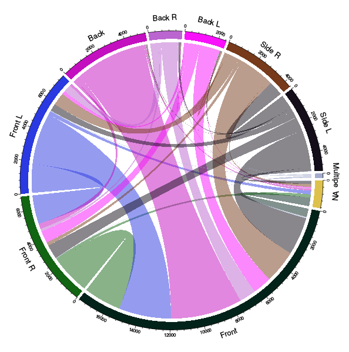

<!-- Limit image width and height -->
<style type='text/css'>
img {
    max-height: 560px;
    max-width: 1000px;
}
</style>

<!-- Center image on slide -->
<script src="http://ajax.aspnetcdn.com/ajax/jQuery/jquery-1.7.min.js"></script>
<script type='text/javascript'>
$(function() {
    $("p:has(img)").addClass('centered');
});
</script>

# Maternity Leave Results  

**Irina Goloshchapova**  
*Expert CMASF*

--- 
## Основные темы

### 1. Визуализация

### 2. Автоматизация

### 3. Машинное обучение

---
## Visualization

1. **Any kind of static graphs**  
   - from simple ggplot2 to complex spatial models and panel graphics  

2. **Animated graphics**  

3. **Interactive graphics and presentations**  
   - *graphics*: from simple time series to complex interaction with user  
   - html-based *analytical reports* with graphs and tables
   - *presentations*  

---

## Static graphs: simple

```{r simple_graphs_1, echo = FALSE, message = FALSE, cache = TRUE, fig.width = 17, fig.height = 10}
library(knitr)
# 3. **Web-applications (need to be fully written in r)**  
#    - html pages on site  
#    - web-applications on rstudio server (fee)  
#    - self-contained web-applications
library(gridExtra)
# For the weatherAUS dataset.
library(rattle)
 
# To generate a density plot.
library(ggplot2)  
cities <- c("Canberra", "Darwin", "Melbourne", "Sydney")
ds <- subset(weatherAUS, Location %in% cities & ! is.na(Temp3pm))
p1  <- ggplot(ds, aes(Temp3pm, colour=Location, fill=Location))
p1  <- p1 + geom_density(alpha=0.55)
p1 <- p1 + theme_bw()

#Let's build a dataset : height of 10 sorgho and poacee sample in 3 environmental conditions (A, B, C)
specie=c(rep("sorgho" , 3) , rep("poacee" , 3) , rep("banana" , 3) , rep("triticum" , 3) )
condition=rep(c("normal" , "stress" , "Nitrogen") , 4)
value=abs(rnorm(12 , 0 , 15))
data=data.frame(specie,condition,value)
 
#Let's plot it with ggplot2
p2 <- ggplot(data, aes(fill=condition, y=value, x=specie))
p2 <- p2 + geom_bar(position="dodge", stat="identity")

grid.arrange(p1, p2, ncol = 2, nrow = 1)
```

---

## Static graphs: medium

```{r medium_graphs_1, echo = FALSE, message = FALSE, cache = TRUE, fig.width = 17, fig.height = 10}
library(ggthemes)
# make data
data=data.frame(group=c("A ","B ","C ","D ") , value=c(33,62,56,67) )
 
# Circular one
p1 <- ggplot(data, aes(x = group, y = value ,fill = group)) + 
  geom_bar(width = 0.85, stat="identity") +    
  
  # To use a polar plot and not a basic barplot
  coord_polar(theta = "y") +    
  
  # Remove useless labels of axis
  xlab("") + ylab("") +
  
  # Increase ylim to avoid having a complete circle
  ylim(c(0,75)) + 
  
  # Add group labels close to the bars :
  geom_text(data = data, hjust = 1, size = 3, aes(x = group, y = 0, label = 
                                                    group))
  
p1 <- p1 + theme(legend.position = "none" , axis.text.y = element_blank(), 
                 axis.ticks = element_blank())

# Second graph
p2 <- ggplot(mtcars, aes(factor(cyl), mpg))
p2 <- p2 + geom_violin(aes(fill = factor(cyl)))
 
grid.arrange(p1, p2, ncol = 2, nrow = 1) 
```

---
## Static graphs: medium

```{r medium_graphs_2, echo = FALSE, message = FALSE, cache = TRUE, fig.width = 17, fig.height = 10}
# Third graph
# Get the data from the web !
CC <- read.table("http://www.sr.bham.ac.uk/~ajrs/papers/sanderson06/mean_Tprofile-CC.txt" ,  header=TRUE)
nCC <- read.table("http://www.sr.bham.ac.uk/~ajrs/papers/sanderson06/mean_Tprofile-nCC.txt" , header=TRUE)
CC$type <- "Cool core"
nCC$type <- "Non-cool core"
A <- rbind(CC, nCC)
 
 
# Make the plot
p3 <- ggplot(data=A, aes(x=r.r500, y=sckT, ymin=sckT.lo, ymax=sckT.up, fill=type, linetype=type)) + 
 geom_line() + 
 geom_ribbon(alpha=0.5) + 
 scale_x_log10() + 
 scale_y_log10() + 
 xlab(as.expression(expression( paste("Radius (", R[500], ")") ))) + 
 ylab("Scaled Temperature")

# Fourth graph
#Create Data
names=c(rep("A", 20) , rep("B", 8) , rep("C", 30), rep("D", 80))
value=c( sample(2:5, 20 , replace=T) , sample(4:10, 8 , replace=T), sample(1:7, 30 , replace=T), sample(3:8, 80 , replace=T) )
data=data.frame(names,value)
 
#Calculation of mean and sd of each group ?
my_mean=aggregate(data$value , by=list(data$names) , mean) ; colnames(my_mean)=c("names" , "mean")
my_sd=aggregate(data$value , by=list(data$names) , sd) ; colnames(my_sd)=c("names" , "sd")
my_info=merge(my_mean , my_sd , by.x=1 , by.y=1)
 
# Make the plot
p4 <- ggplot(data) + 
        geom_point(aes(x = names, y = value) , colour=rgb(0.8,0.7,0.1,0.4) , size=5) + 
        geom_point(data = my_info, aes(x=names , y = mean) , colour = rgb(0.6,0.5,0.4,0.7) , size = 8) +
        geom_errorbar(data = my_info, aes(x = names, y = sd, ymin = mean - sd, ymax = mean + sd), colour = rgb(0.4,0.8,0.2,0.4) , width = 0.7 , size=1.5)

grid.arrange(p4, p3, ncol = 2, nrow = 1)
```

---

## Static graphs: interesting
#### Correlogram

```{r unteresting_graphs_1, echo = FALSE, message = FALSE, cache = TRUE}
library(corrgram)
corrgram(auto, order=TRUE, main="Auto data (PC order)", lower.panel=corrgram::panel.ellipse, upper.panel=panel.bar, diag.panel=panel.minmax, col.regions=colorRampPalette(c("darkgoldenrod4", "burlywood1", "darkkhaki", "darkgreen")))
```

---

## Static graphs: interesting
#### Mosaic plot

```{r interesting_graphs_2, echo = FALSE, message = FALSE, cache = TRUE}
library(vcd)
mosaic(~ Class + Sex + Age + Survived, data = Titanic, shade = TRUE, legend = TRUE)
```

---

## Static graphs: interesting
#### Diagnostic plots

```{r interesting_graphs_3, echo = FALSE, message = FALSE, cache = TRUE}
library(GGally)
ggpairs(mtcars[, 3:7],upper = list(continuous = "density", combo = "box"), lower = list(continuous = "points", combo = "dot"), mapping = ggplot2::aes_string(colour = mtcars$gear,alpha=0.3))

```

---
## Static graphs: interesting
#### Panel maps


---
## Static graphs: interesting
#### Chord Diagram



---
## Animated graphics  

<iframe src = 'http://revolution-computing.typepad.com/.a/6a010534b1db25970b01b8d1a4d670970c-pi' width = '600px' height = '600px'> </iframe>

---
## Interactive graphics and presentations

```{r rcharts_1, echo = FALSE, message = FALSE, results = 'asis', comment = NA}
# pkgs <- c("slidify", "slidifyLibraries", "rCharts")
# devtools::install_github(pkgs, "ramnathv", ref = "dev")
# library(devtools)
# install_github('ramnathv/slidify', ref = github_pull(425))
require(rCharts)
haireye = as.data.frame(HairEyeColor)
n1 <- nPlot(Freq ~ Hair,
            group = 'Eye',
            data = subset(haireye, Sex = 'Male'),
            type = 'multiBarChart')
n1$set(width = 700, height = 350)
n1$print('chart1')
```

---
