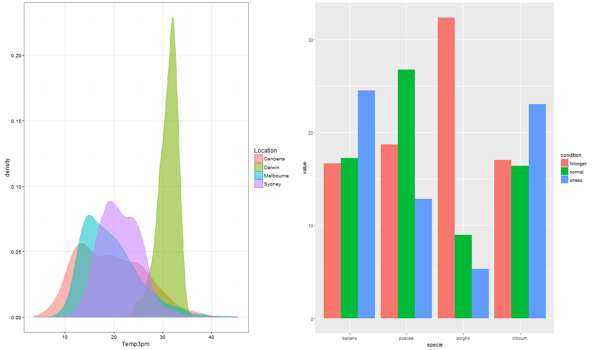
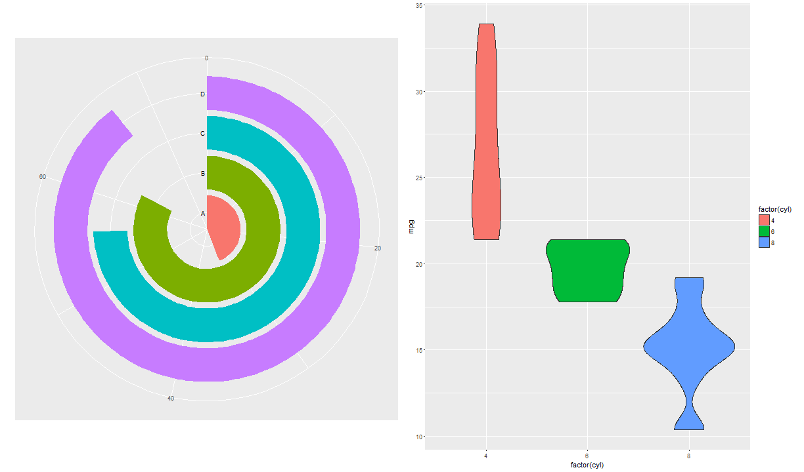
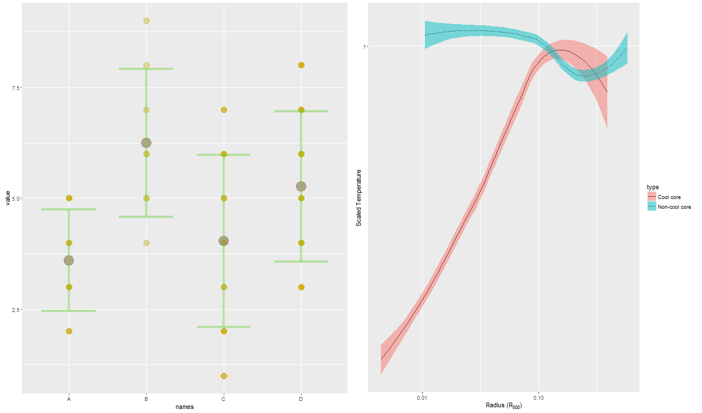
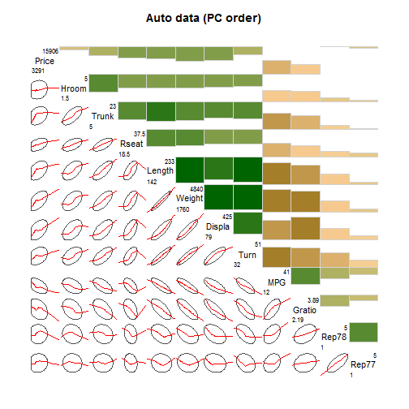
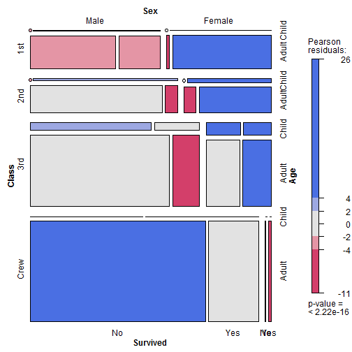
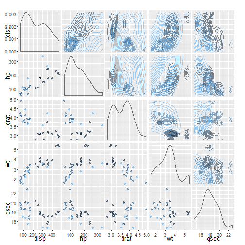

<!-- Limit image width and height -->

<!-- Center image on slide -->

# Maternity Leave Results  

**Irina Goloshchapova**  
*Expert CMASF*

--- 
## Main Themes

### 1. Визуализация
#### All what you want to know but are afraid to ask...

### 2. Automatization

### 3. Machine Learning

---
## Visualization

1. **Any kind of static graphs**  
   - from simple ggplot2 to complex spatial models and panel graphics  

2. **Animated graphics**  

3. **Interactive graphics and presentations**  
   - *graphics*: from simple time series to complex interaction with user  
   - *presentations*  

---

## Static graphs: simple

---

## Static graphs: medium

---
## Static graphs: medium

---

## Static graphs: interesting
#### Correlogram

---

## Static graphs: interesting
#### Mosaic plot

---

## Static graphs: interesting
#### Diagnostic plots

---
## Static graphs: interesting
#### Panel maps

---
## Static graphs: interesting
#### Chord Diagram

---
## Animated graphics  

<iframe src = 'http://revolution-computing.typepad.com/.a/6a010534b1db25970b01b8d1a4d670970c-pi' width = '600px' height = '600px'> </iframe>

---
## Interactive graphics and presentations  
#### Simple graphs

<iframe src=' assets/fig/rcharts_1-1.html ' scrolling='no' frameBorder='0' seamless class='rChart nvd3 ' id=iframe- chart13844e6d4316 ></iframe> 

---
## Interactive graphics and presentations  
#### Simple graphs

<iframe src = 'figures/compan.html' width = '850px' height = '450px'> </iframe>

---
## Interactive graphics and presentations  
#### Maps

<iframe src = "highmap.html" width = '750px' height = '600px'> </iframe>

---
## Interactive graphics and presentations  
#### Time Series

<iframe src = "DVis_PA1_for_pres.html" width = '900px' height = '700px'> </iframe>

---
## Interactive graphics and presentations  
#### Simple graphs with controls

<!-- MotionChart generated in R 3.2.3 by googleVis 0.5.10 package -->
<!-- Wed Mar 02 23:39:55 2016 -->

<!-- jsHeader -->

 
<!-- jsChart -->  

 
<!-- divChart -->
  

---
## Interactive graphics and presentations  
#### Combinations of simple graphs

<!-- GeoChart generated in R 3.2.3 by googleVis 0.5.10 package -->
<!-- Thu Mar 03 16:31:00 2016 -->

<!-- jsHeader -->

 
<!-- jsChart -->  

<!-- jsChart -->  

<!-- jsChart -->  

<!-- jsChart -->  

 
<table border="0">
<tr>
<td>

<table border="0">
<tr>
<td>

<!-- divChart -->
  

</td>
</tr>
<tr>
<td>

<!-- divChart -->
  

</td>
</tr>
</table>

</td>
<td>

<table border="0">
<tr>
<td>

<!-- divChart -->
  

</td>
</tr>
<tr>
<td>

<!-- divChart -->
  

</td>
</tr>
</table>

</td>
</tr>
</table>

---
## Interactive graphics and presentations  
#### Interesting: Sankey plot

<iframe src=' assets/fig/rcharts_3-1.html ' scrolling='no' frameBorder='0' seamless class='rChart http://timelyportfolio.github.io/rCharts_d3_sankey/libraries/widgets/d3_sankey ' id=iframe- chart8807cd24d70 ></iframe> 

---
## Interactive graphics and presentations  
#### Interesting: graph analysis

<iframe src = "network.html" width = '1000px' height = '750px'> </iframe>

---
## Interactive graphics and presentations  
#### Interesting: graph analysis

<iframe src = "network2.html" width = '1000px' height = '750px'> </iframe>

---
## Interactive graphics and presentations  
#### Interesting: path diagram

<iframe src = "http://timelyportfolio.github.io/rCharts_512paths/" width = '1050px' height = '800px'> </iframe>

---
## Interactive graphics and presentations  
#### Plot.ly

<iframe src = "https://plot.ly/r/" width = '1050px' height = '800px'> </iframe>

---
## Interactive graphics and presentations  
#### Tableau

<iframe src = "https://public.tableau.com/s/gallery" width = '1050px' height = '800px'> </iframe>
