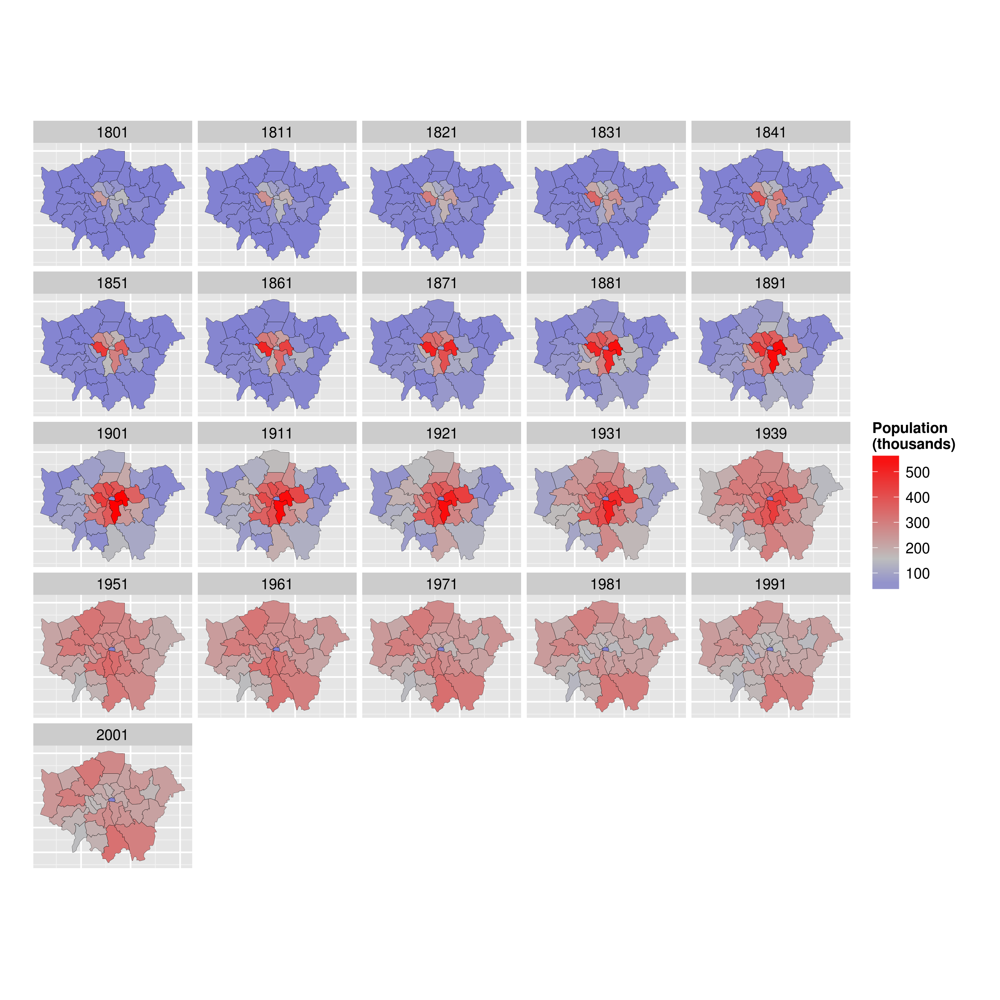

<!-- Limit image width and height -->

<!-- Center image on slide -->

# Maternity Leave Results  

**Irina Goloshchapova**  
*Expert CMASF*

--- 
## Main Themes

### 1. Visualization

### 2. Automatization

### 3. Machine Learning

---
## Visualization

1. **Any kind of static graphs**  
   - from simple ggplot2 to complex spatial models and panel graphics  

2. **Animated graphics**  

3. **Interactive graphics and presentations**  
   - *graphics*: from simple time series to complex interaction with user  
   - html-based *analytical reports* with graphs and tables
   - *presentations*  

---

## Static graphs: simple

---

## Static graphs: medium

---
## Static graphs: medium

---

## Static graphs: interesting
#### Correlogram

---

## Static graphs: interesting
#### Mosaic plot

---

## Static graphs: interesting
#### Diagnostic plots

---
## Static graphs: interesting
#### Panel maps

---
## Static graphs: interesting
#### Chord Diagram

---
## Animated graphics  

<iframe src = 'http://revolution-computing.typepad.com/.a/6a010534b1db25970b01b8d1a4d670970c-pi' width = '600px' height = '600px'> </iframe>

---
## Interactive graphics and presentations  
#### Simple graphs

<iframe src=' assets/fig/rcharts_1-1.html ' scrolling='no' frameBorder='0' seamless class='rChart nvd3 ' id=iframe- chart13844e6d4316 ></iframe> 

---
## Interactive graphics and presentations  
#### Simple graphs

<iframe src = 'figures/compan.html' width = '850px' height = '450px'> </iframe>

---
## Interactive graphics and presentations  
#### Maps

<iframe src = "map_gdp.html" width = '600px' height = '500px'> </iframe>

--- 
## Interactive graphics and presentations  
#### Medium

---
